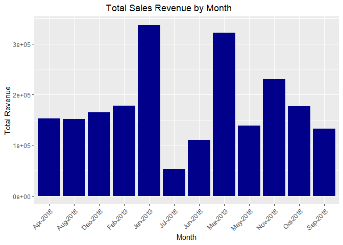
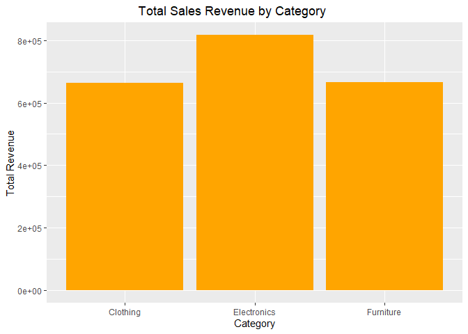
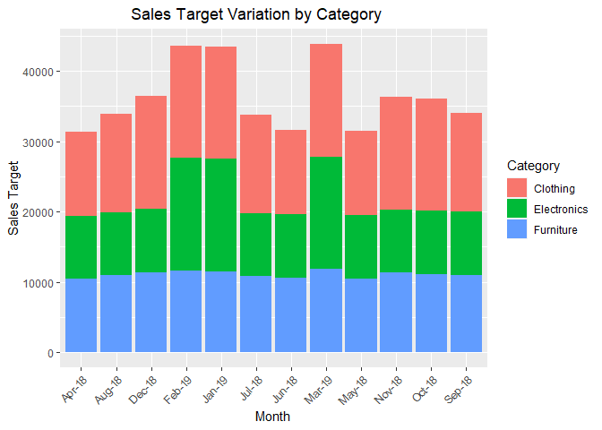
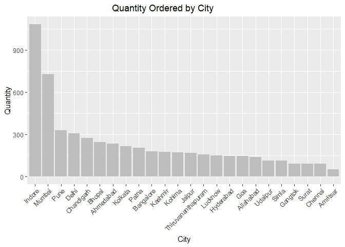
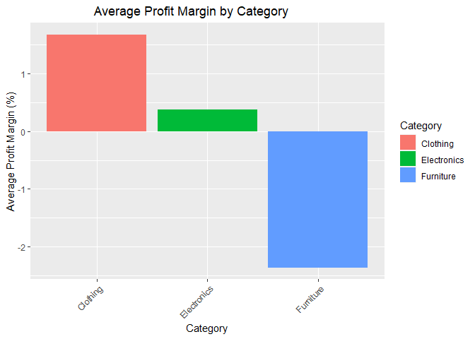
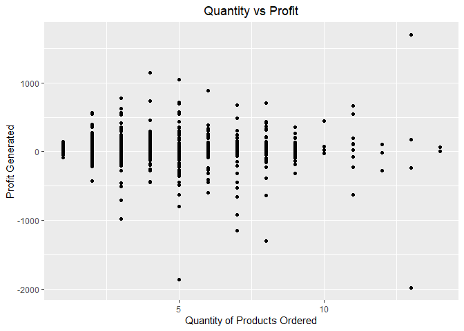
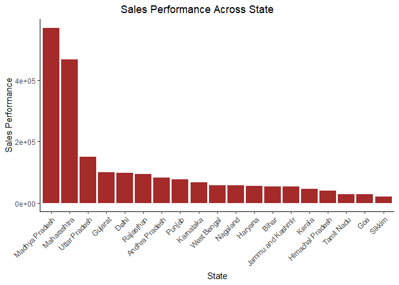
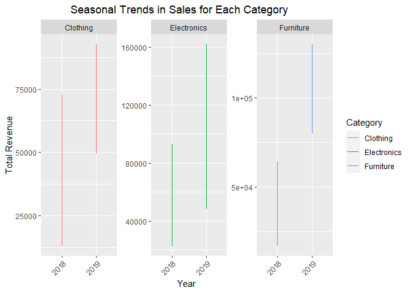
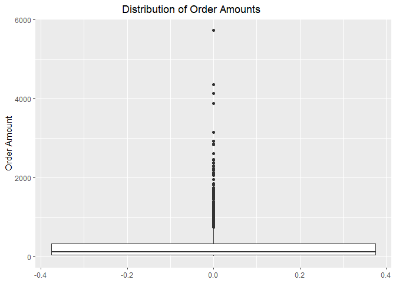
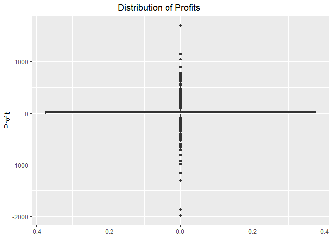

Analyzing Sales Performance: E-Commerce Insights from Indian Market
================

### Introduction:

Welcome to the world of e-commerce sales analysis! In this dataset, we
delve into the dynamic landscape of Indian e-commerce, exploring the
intricacies of sales performance through meticulously curated data. Our
dataset, sourced from
[Kaggle](https://www.kaggle.com/datasets/benroshan/ecommerce-data),
comprises three comprehensive CSV files: List of Orders, Order Details,
and Sales Targets. Through thorough analysis, we aim to uncover valuable
insights that can inform strategic decision-making in the e-commerce
industry.

### Dataset Overview:

1.  List of Orders: This dataset offers a granular view of purchase
    information, encompassing essential data points such as Order ID,
    Date of Purchase, and Customer Details.
2.  Order Details: Delving deeper, this dataset provides intricate
    insights into Order ID, Order Price, Quantity, Profit, and detailed
    Category and Subcategory information.
3.  Sales Target: Illuminating overarching objectives, this dataset
    delineates sales target amounts and dates for each product category.

**Objective:** Our objective is to address ten pivotal business
questions, unraveling the nuanced facets of sales performance within the
dynamic e-commerce landscape of India.

### Load Packages:

``` r
library(tidyverse)
```

    ## Warning: package 'tidyverse' was built under R version 4.3.2

    ## ── Attaching core tidyverse packages ──────────────────────── tidyverse 2.0.0 ──
    ## ✔ dplyr     1.1.2     ✔ readr     2.1.4
    ## ✔ forcats   1.0.0     ✔ stringr   1.5.0
    ## ✔ ggplot2   3.4.2     ✔ tibble    3.2.1
    ## ✔ lubridate 1.9.2     ✔ tidyr     1.3.0
    ## ✔ purrr     1.0.1     
    ## ── Conflicts ────────────────────────────────────────── tidyverse_conflicts() ──
    ## ✖ dplyr::filter() masks stats::filter()
    ## ✖ dplyr::lag()    masks stats::lag()
    ## ℹ Use the conflicted package (<http://conflicted.r-lib.org/>) to force all conflicts to become errors

``` r
library(readxl)
```

### Data Cleaning

***List of Orders Dataset***

We began by examining the List of Orders dataset, ensuring data
integrity and consistency. Following conversion of the “Order Date”
column to the appropriate date datatype, we conducted a comprehensive
review for irregularities, ensuring a clean dataset ready for analysis.

``` r
Orders <- read_xlsx("C:/Users/1040/OneDrive/Documents/Data Analysts/Teaching Plan/R Studio/sales data/List of Orders.xlsx")
str(Orders)
```

    ## tibble [500 × 5] (S3: tbl_df/tbl/data.frame)
    ##  $ Order ID    : chr [1:500] "B-25601" "B-25602" "B-25603" "B-25604" ...
    ##  $ Order Date  : POSIXct[1:500], format: "2018-04-01" "2018-04-01" ...
    ##  $ CustomerName: chr [1:500] "Bharat" "Pearl" "Jahan" "Divsha" ...
    ##  $ State       : chr [1:500] "Gujarat" "Maharashtra" "Madhya Pradesh" "Rajasthan" ...
    ##  $ City        : chr [1:500] "Ahmedabad" "Pune" "Bhopal" "Jaipur" ...

Converted “Order Date” column from POSIXct to Date Datatype

``` r
Orders$`Order Date` <- as.Date(ymd(Orders$`Order Date`))
glimpse(Orders)
```

    ## Rows: 500
    ## Columns: 5
    ## $ `Order ID`   <chr> "B-25601", "B-25602", "B-25603", "B-25604", "B-25605", "B…
    ## $ `Order Date` <date> 2018-04-01, 2018-04-01, 2018-04-03, 2018-04-03, 2018-04-…
    ## $ CustomerName <chr> "Bharat", "Pearl", "Jahan", "Divsha", "Kasheen", "Hazel",…
    ## $ State        <chr> "Gujarat", "Maharashtra", "Madhya Pradesh", "Rajasthan", …
    ## $ City         <chr> "Ahmedabad", "Pune", "Bhopal", "Jaipur", "Kolkata", "Bang…

Checked for irregularities in dataset and it appeared to be free from
errors

``` r
Orders %>% 
  select(City) %>% 
  unique() %>% 
  arrange(desc(City))
```

    ## # A tibble: 24 × 1
    ##    City              
    ##    <chr>             
    ##  1 Udaipur           
    ##  2 Thiruvananthapuram
    ##  3 Surat             
    ##  4 Simla             
    ##  5 Pune              
    ##  6 Patna             
    ##  7 Mumbai            
    ##  8 Lucknow           
    ##  9 Kolkata           
    ## 10 Kohima            
    ## # ℹ 14 more rows

Checked for duplicate in the Orders Dataset

``` r
anyDuplicated(Orders)
```

    ## [1] 0

***Order Details***

Similarly, our analysis extended to the Order Details dataset, where we
meticulously inspected each column for any anomalies or misspellings.
Following necessary datatype conversions and column renaming, we
prepared the data for further analysis.

``` r
Details <- read_xlsx("C:/Users/1040/OneDrive/Documents/Data Analysts/Teaching Plan/R Studio/sales data/Order Details.xlsx")
glimpse(Details)
```

    ## Rows: 1,500
    ## Columns: 6
    ## $ `Order ID`     <chr> "B-25601", "B-25601", "B-25601", "B-25601", "B-25602", …
    ## $ Amount         <dbl> 1275, 66, 8, 80, 168, 424, 2617, 561, 119, 1355, 24, 19…
    ## $ Profit         <dbl> -1148, -12, -2, -56, -111, -272, 1151, 212, -5, -60, -3…
    ## $ Quantity       <dbl> 7, 5, 3, 4, 2, 5, 4, 3, 8, 5, 1, 3, 3, 4, 6, 2, 1, 2, 9…
    ## $ Category       <chr> "Furniture", "Clothing", "Clothing", "Electronics", "El…
    ## $ `Sub-Category` <chr> "Bookcases", "Stole", "Hankerchief", "Electronic Games"…

Checked for irregularities in dataset

``` r
Details %>% 
  select(Quantity) %>% 
  unique()
```

    ## # A tibble: 14 × 1
    ##    Quantity
    ##       <dbl>
    ##  1        7
    ##  2        5
    ##  3        3
    ##  4        4
    ##  5        2
    ##  6        8
    ##  7        1
    ##  8        6
    ##  9        9
    ## 10       13
    ## 11       11
    ## 12       12
    ## 13       10
    ## 14       14

No irregularities found, so converted the “Amount” and “Quantity”
columns to integer datatype

``` r
Details$Amount <- as.integer(Details$Amount)
Details$Quantity <- as.integer(Details$Quantity)
glimpse(Details)
```

    ## Rows: 1,500
    ## Columns: 6
    ## $ `Order ID`     <chr> "B-25601", "B-25601", "B-25601", "B-25601", "B-25602", …
    ## $ Amount         <int> 1275, 66, 8, 80, 168, 424, 2617, 561, 119, 1355, 24, 19…
    ## $ Profit         <dbl> -1148, -12, -2, -56, -111, -272, 1151, 212, -5, -60, -3…
    ## $ Quantity       <int> 7, 5, 3, 4, 2, 5, 4, 3, 8, 5, 1, 3, 3, 4, 6, 2, 1, 2, 9…
    ## $ Category       <chr> "Furniture", "Clothing", "Clothing", "Electronics", "El…
    ## $ `Sub-Category` <chr> "Bookcases", "Stole", "Hankerchief", "Electronic Games"…

Changed the column name “Amount” to “Order Price”

``` r
Details <- rename(Details, Order_Price = Amount)
```

Inspected the other columns for misspelling or irregularities

``` r
Details %>% 
  select(`Sub-Category`) %>% 
  unique()
```

    ## # A tibble: 17 × 1
    ##    `Sub-Category`  
    ##    <chr>           
    ##  1 Bookcases       
    ##  2 Stole           
    ##  3 Hankerchief     
    ##  4 Electronic Games
    ##  5 Phones          
    ##  6 Saree           
    ##  7 Trousers        
    ##  8 Chairs          
    ##  9 Kurti           
    ## 10 T-shirt         
    ## 11 Shirt           
    ## 12 Leggings        
    ## 13 Tables          
    ## 14 Printers        
    ## 15 Accessories     
    ## 16 Furnishings     
    ## 17 Skirt

Checked for duplicate in the details Dataset

``` r
anyDuplicated(Details)
```

    ## [1] 0

calculated revenue

``` r
Details <- Details %>% 
  mutate(Revenue = Order_Price * Quantity)
```

***Sales target***

Our data cleaning process also encompassed the Sales_target dataset,
where we standardized date formats and verified data consistency. These
steps laid the foundation for robust analysis and interpretation of
sales targets across different product categories.

``` r
Sales_target <-  read_xlsx("C:/Users/1040/OneDrive/Documents/Data Analysts/Teaching Plan/R Studio/sales data/Sales target.xlsx")
  str(Sales_target)
```

    ## tibble [36 × 3] (S3: tbl_df/tbl/data.frame)
    ##  $ Month of Order Date: POSIXct[1:36], format: "2018-04-01" "2018-05-01" ...
    ##  $ Category           : chr [1:36] "Furniture" "Furniture" "Furniture" "Furniture" ...
    ##  $ Target             : num [1:36] 10400 10500 10600 10800 10900 11000 11100 11300 11400 11500 ...

Converted “Month of Order Date” column from POSIXct datatype, to date
datatype

``` r
Sales_target$`Month of Order Date`<- as.Date(ymd(Sales_target$`Month of Order Date`))
glimpse(Sales_target)
```

    ## Rows: 36
    ## Columns: 3
    ## $ `Month of Order Date` <date> 2018-04-01, 2018-05-01, 2018-06-01, 2018-07-01,…
    ## $ Category              <chr> "Furniture", "Furniture", "Furniture", "Furnitur…
    ## $ Target                <dbl> 10400, 10500, 10600, 10800, 10900, 11000, 11100,…

converted “Target” column from double to integer datatype

``` r
Sales_target$Target <- as.integer(Sales_target$Target)
glimpse(Sales_target)
```

    ## Rows: 36
    ## Columns: 3
    ## $ `Month of Order Date` <date> 2018-04-01, 2018-05-01, 2018-06-01, 2018-07-01,…
    ## $ Category              <chr> "Furniture", "Furniture", "Furniture", "Furnitur…
    ## $ Target                <int> 10400, 10500, 10600, 10800, 10900, 11000, 11100,…

Inspected each column for any irregularities in the sales_target dataset

``` r
Sales_target %>% 
  select(Category) %>% 
  unique()
```

    ## # A tibble: 3 × 1
    ##   Category   
    ##   <chr>      
    ## 1 Furniture  
    ## 2 Clothing   
    ## 3 Electronics

Checked for duplicate in dataset

``` r
anyDuplicated(Sales_target)
```

    ## [1] 0

## Business Question and Answer

1.  **What is the total sales revenue for each month?**

By merging the Orders and Details datasets, we calculated the total
sales revenue for each month.

``` r
OrderDetails <- inner_join(Orders, Details, by = "Order ID")
glimpse(OrderDetails)
```

    ## Rows: 1,500
    ## Columns: 11
    ## $ `Order ID`     <chr> "B-25601", "B-25601", "B-25601", "B-25601", "B-25602", …
    ## $ `Order Date`   <date> 2018-04-01, 2018-04-01, 2018-04-01, 2018-04-01, 2018-0…
    ## $ CustomerName   <chr> "Bharat", "Bharat", "Bharat", "Bharat", "Pearl", "Pearl…
    ## $ State          <chr> "Gujarat", "Gujarat", "Gujarat", "Gujarat", "Maharashtr…
    ## $ City           <chr> "Ahmedabad", "Ahmedabad", "Ahmedabad", "Ahmedabad", "Pu…
    ## $ Order_Price    <int> 1275, 66, 8, 80, 168, 424, 2617, 561, 119, 1355, 24, 19…
    ## $ Profit         <dbl> -1148, -12, -2, -56, -111, -272, 1151, 212, -5, -60, -3…
    ## $ Quantity       <int> 7, 5, 3, 4, 2, 5, 4, 3, 8, 5, 1, 3, 3, 4, 6, 2, 1, 2, 9…
    ## $ Category       <chr> "Furniture", "Clothing", "Clothing", "Electronics", "El…
    ## $ `Sub-Category` <chr> "Bookcases", "Stole", "Hankerchief", "Electronic Games"…
    ## $ Revenue        <int> 8925, 330, 24, 320, 336, 2120, 10468, 1683, 952, 6775, …

Converted ‘Order Date’ to month-year format

``` r
OrderDetails$Month <- format(OrderDetails$`Order Date`, "%b-%Y")
```

Calculated total sales revenue for each month

``` r
monthly_revenue <- OrderDetails %>%
  group_by(Month) %>%
  summarise(Total_Revenue = sum(Revenue))
print(monthly_revenue)
```

    ## # A tibble: 12 × 2
    ##    Month    Total_Revenue
    ##    <chr>            <int>
    ##  1 Apr-2018        152827
    ##  2 Aug-2018        151514
    ##  3 Dec-2018        164839
    ##  4 Feb-2019        177620
    ##  5 Jan-2019        337229
    ##  6 Jul-2018         53144
    ##  7 Jun-2018        110015
    ##  8 Mar-2019        321750
    ##  9 May-2018        138767
    ## 10 Nov-2018        229785
    ## 11 Oct-2018        176663
    ## 12 Sep-2018        132717

Used Visualization to project the total sales revenue for each month

``` r
ggplot(monthly_revenue, aes(x = Month, y = Total_Revenue)) +
  geom_bar(stat = "identity", fill = "darkblue") +
  labs(x = "Month", y = "Total Revenue", title = "Total Sales Revenue by Month") +
  theme(axis.text.x = element_text(angle = 45, hjust = 1), plot.title = element_text(hjust = 0.4))
```

<!-- -->

**Result:**

From the analysis shown, these findings revealed that January 2019
boasted the highest sales revenue totaling 337,229 Indian Rupee(INR),
indicating a potential peak period for e-commerce sales.

2.  **Which category has the highest sales revenue in the given
    period?**

calculated total sales revenue for each category

``` r
category_revenue <- OrderDetails %>% 
  group_by(Category) %>% 
  summarise(Total_revenue = sum(Revenue))
print(category_revenue)
```

    ## # A tibble: 3 × 2
    ##   Category    Total_revenue
    ##   <chr>               <int>
    ## 1 Clothing           664522
    ## 2 Electronics        816583
    ## 3 Furniture          665765

Filtered to display the category with the highest sales revenue

``` r
category_highest_revenue <- category_revenue %>% 
  filter(Total_revenue == max(Total_revenue))

print(category_highest_revenue)
```

    ## # A tibble: 1 × 2
    ##   Category    Total_revenue
    ##   <chr>               <int>
    ## 1 Electronics        816583

Used Visualization to project the category of total sales revenue

``` r
ggplot(category_revenue, aes(x = Category, y = Total_revenue)) +
  geom_bar(stat = "identity", fill = "orange") +
  labs(x = "Category", y = "Total Revenue", title = "Total Sales Revenue by Category") +
  theme(plot.title = element_text(hjust = 0.4))
```

<!-- -->

**Result:**

Our analysis revealed that the Electronics category commanded the
highest sales revenue with 816,583 Indian Rupee(INR), underscoring its
significance within the e-commerce domain.

3.  **How does the sales target for each category vary month by month?**

Converted the “Month of Order Date” to month-year

``` r
Sales_target$`Month`<- format(Sales_target$`Month of Order Date`, "%b-%y")
```

Calculated sales target for each month

``` r
category_saleTarget <- Sales_target %>% 
  select(Category, Target, Month) %>% 
  group_by(Month, Category) %>% 
  summarise(Total_Target = sum(Target))
```

    ## `summarise()` has grouped output by 'Month'. You can override using the
    ## `.groups` argument.

``` r
print(category_saleTarget)
```

    ## # A tibble: 36 × 3
    ## # Groups:   Month [12]
    ##    Month  Category    Total_Target
    ##    <chr>  <chr>              <int>
    ##  1 Apr-18 Clothing           12000
    ##  2 Apr-18 Electronics         9000
    ##  3 Apr-18 Furniture          10400
    ##  4 Aug-18 Clothing           14000
    ##  5 Aug-18 Electronics         9000
    ##  6 Aug-18 Furniture          10900
    ##  7 Dec-18 Clothing           16000
    ##  8 Dec-18 Electronics         9000
    ##  9 Dec-18 Furniture          11400
    ## 10 Feb-19 Clothing           16000
    ## # ℹ 26 more rows

Used Visualization to show the variation of sales targets for each
category over the months

``` r
ggplot(category_saleTarget, aes(x = Month, y = Total_Target, fill = Category)) +
  geom_bar(stat = "identity") +
  labs(x = "Month", y = "Sales Target", title = "Sales Target Variation by Category") +
  theme(axis.text.x = element_text(angle = 45, hjust = 1), legend.position = "right", plot.title = element_text(hjust = 0.4))
```

<!-- -->

**Result:**

By dissecting sales targets across categories, we discerned fluctuations
over time, shedding light on evolving trends and priorities.

4.  **Which city has the highest number of orders?**

``` r
HighestOrder <- OrderDetails %>% 
  select(City, Quantity) %>% 
  group_by(City) %>% 
  summarise(Num_Orders = sum(Quantity)) %>% 
  arrange(desc(Num_Orders))

print(HighestOrder)
```

    ## # A tibble: 24 × 2
    ##    City       Num_Orders
    ##    <chr>           <int>
    ##  1 Indore           1084
    ##  2 Mumbai            727
    ##  3 Pune              329
    ##  4 Delhi             306
    ##  5 Chandigarh        275
    ##  6 Bhopal            247
    ##  7 Ahmedabad         235
    ##  8 Kolkata           216
    ##  9 Patna             206
    ## 10 Bangalore         180
    ## # ℹ 14 more rows

Used Visualization to show the city with the highest number of order

``` r
HighestOrder$City <- factor(HighestOrder$City,
                            levels = HighestOrder$City[order(-HighestOrder$Num_Orders)])

ggplot(HighestOrder, aes(x = City, y = Num_Orders)) +
  geom_bar(stat = "identity", fill = "grey") +
  labs(x = "City", y = "Quantity", title = "Quantity Ordered by City") +
  theme(axis.text.x = element_text(angle = 45, hjust = 1), legend.position = "right", plot.title = element_text(hjust = 0.4))
```

<!-- -->

**Result:**

Indore emerged as the city with the highest number of orders (1084),
reflecting its pivotal role in driving e-commerce transactions.

5.  **What is the average profit margin for each category?**

``` r
ProfitMargin <- OrderDetails %>%  
  group_by(Category) %>% 
  summarise(`Avg Profit Margin` = mean(Profit / Revenue * 100))

print(ProfitMargin)
```

    ## # A tibble: 3 × 2
    ##   Category    `Avg Profit Margin`
    ##   <chr>                     <dbl>
    ## 1 Clothing                  1.68 
    ## 2 Electronics               0.375
    ## 3 Furniture                -2.36

Used Visualization to show the average profit margin for each category

``` r
ggplot(ProfitMargin, aes(x = Category, y = `Avg Profit Margin`, fill = Category)) +
  geom_bar(stat = "identity") +
  labs(x = "Category", y = "Average Profit Margin (%)", title = "Average Profit Margin by Category") +
  theme(axis.text.x = element_text(angle = 45, hjust = 1), plot.title = element_text(hjust = 0.4))
```

<!-- -->

**Result:**

Through meticulous analysis, we uncovered varying profit margins across
categories, with Clothing exhibiting the highest average margin.

6.  **Is there any correlation between the quantity of products ordered
    and the profit generated?**

In order to check for correlation between the quantity of products
ordered and the profit generated, we used a scattered plot visuals for
this.

``` r
ggplot(OrderDetails, aes(x = Quantity, y = Profit)) +
  geom_point() +
  labs(x = "Quantity of Products Ordered", y = "Profit Generated", title = "Quantity vs Profit") +
  theme(plot.title = element_text(hjust = 0.5))
```

<!-- -->

Calculated correlation coefficient, we also used the ’cor() function:

``` r
correlation <- cor(OrderDetails$Quantity, OrderDetails$Profit)
print(correlation)
```

    ## [1] 0.00244136

**Result:**

The scattered plot and the calculation result value revealed a very weak
positive relationship between the quantity of products ordered and the
profit generated.

7.  **What is the percentage achievement of sales targets for each
    category?**

To calculate the percentage achievement, we will first join the
“OrderDetails” table with the “Sales_target” table using category column

``` r
joined_data <- inner_join(OrderDetails, Sales_target, by = "Category")
```

    ## Warning in inner_join(OrderDetails, Sales_target, by = "Category"): Detected an unexpected many-to-many relationship between `x` and `y`.
    ## ℹ Row 1 of `x` matches multiple rows in `y`.
    ## ℹ Row 13 of `y` matches multiple rows in `x`.
    ## ℹ If a many-to-many relationship is expected, set `relationship =
    ##   "many-to-many"` to silence this warning.

``` r
print(joined_data)
```

    ## # A tibble: 18,000 × 15
    ##    `Order ID` `Order Date` CustomerName State  City  Order_Price Profit Quantity
    ##    <chr>      <date>       <chr>        <chr>  <chr>       <int>  <dbl>    <int>
    ##  1 B-25601    2018-04-01   Bharat       Gujar… Ahme…        1275  -1148        7
    ##  2 B-25601    2018-04-01   Bharat       Gujar… Ahme…        1275  -1148        7
    ##  3 B-25601    2018-04-01   Bharat       Gujar… Ahme…        1275  -1148        7
    ##  4 B-25601    2018-04-01   Bharat       Gujar… Ahme…        1275  -1148        7
    ##  5 B-25601    2018-04-01   Bharat       Gujar… Ahme…        1275  -1148        7
    ##  6 B-25601    2018-04-01   Bharat       Gujar… Ahme…        1275  -1148        7
    ##  7 B-25601    2018-04-01   Bharat       Gujar… Ahme…        1275  -1148        7
    ##  8 B-25601    2018-04-01   Bharat       Gujar… Ahme…        1275  -1148        7
    ##  9 B-25601    2018-04-01   Bharat       Gujar… Ahme…        1275  -1148        7
    ## 10 B-25601    2018-04-01   Bharat       Gujar… Ahme…        1275  -1148        7
    ## # ℹ 17,990 more rows
    ## # ℹ 7 more variables: Category <chr>, `Sub-Category` <chr>, Revenue <int>,
    ## #   Month.x <chr>, `Month of Order Date` <date>, Target <int>, Month.y <chr>

Now we grouped the data, then calculated the percentage achievement of
sales target for each category.

``` r
Category_sales <- joined_data %>% 
  select(Category, Revenue, Target) %>% 
  group_by(Category) %>% 
  summarise(Total_Revenue = sum(Revenue),
            Total_SaleTarget = sum(Target),
            Percentage_achievement = (Total_Revenue / Total_SaleTarget) * 100)

print(Category_sales)
```

    ## # A tibble: 3 × 4
    ##   Category    Total_Revenue Total_SaleTarget Percentage_achievement
    ##   <chr>               <int>            <int>                  <dbl>
    ## 1 Clothing          7974264        165126000                   4.83
    ## 2 Electronics       9798996         39732000                  24.7 
    ## 3 Furniture         7989180         32294700                  24.7

**Result:**

Percentage achievements varied, with Clothing at 4.83%, Electronics at
24.66%, and Furniture at 24.74%.

8.  **How does the sales performance vary across different states?**

we grouped the data by state and calculated the total revenue for each
state.

``` r
State_Sales <- OrderDetails %>% 
  select(Revenue, State) %>% 
  group_by(State) %>% 
  summarise(`Sales Performance` = sum(Revenue)) %>% 
  arrange(desc(`Sales Performance`))

print(State_Sales)
```

    ## # A tibble: 19 × 2
    ##    State             `Sales Performance`
    ##    <chr>                           <int>
    ##  1 Madhya Pradesh                 569685
    ##  2 Maharashtra                    467660
    ##  3 Uttar Pradesh                  150032
    ##  4 Gujarat                        100292
    ##  5 Delhi                           97071
    ##  6 Rajasthan                       94050
    ##  7 Andhra Pradesh                  82897
    ##  8 Punjab                          77591
    ##  9 Karnataka                       66231
    ## 10 West Bengal                     58035
    ## 11 Nagaland                        57985
    ## 12 Haryana                         54891
    ## 13 Bihar                           54082
    ## 14 Jammu and Kashmir               53201
    ## 15 Kerala                          46158
    ## 16 Himachal Pradesh                39850
    ## 17 Tamil Nadu                      29195
    ## 18 Goa                             27919
    ## 19 Sikkim                          20045

Visualized the sales performance across state in descending order.

``` r
State_Sales$State <- factor(State_Sales$State, levels = State_Sales$State[order(-State_Sales$`Sales Performance`)])

ggplot(State_Sales, aes(x = State, y = `Sales Performance`)) +
  geom_bar(stat = "identity", fill = "brown") +
  labs(title = "Sales Performance Across State", x = "State", y = "Sales Performance") +
  theme_classic() +
  theme(axis.text.x = element_text(angle = 45, hjust = 1), plot.title = element_text(hjust = 0.4))
```

<!-- -->
**Result:**

Madhya Pradesh emerged as the highest-performing state in terms of sales
performance.

9.  **Can we identify any seasonal trends in sales for each category?**

we extracted year and month from `order Date`

``` r
OrderDetails$Year <- format(OrderDetails$`Order Date`, "%Y")
OrderDetails$Months <- format(OrderDetails$`Order Date`, "%b")
```

Grouped the data by month, year, and category, then calculated the total
revenue.

``` r
Monthly_category_sales <- OrderDetails %>% 
  select(Year, Months, Category, Revenue) %>% 
  group_by(Year, Months, Category) %>% 
  summarise(Sales = sum(Revenue))
```

    ## `summarise()` has grouped output by 'Year', 'Months'. You can override using
    ## the `.groups` argument.

``` r
print(Monthly_category_sales)
```

    ## # A tibble: 36 × 4
    ## # Groups:   Year, Months [12]
    ##    Year  Months Category    Sales
    ##    <chr> <chr>  <chr>       <int>
    ##  1 2018  Apr    Clothing    67649
    ##  2 2018  Apr    Electronics 43637
    ##  3 2018  Apr    Furniture   41541
    ##  4 2018  Aug    Clothing    59474
    ##  5 2018  Aug    Electronics 47050
    ##  6 2018  Aug    Furniture   44990
    ##  7 2018  Dec    Clothing    43306
    ##  8 2018  Dec    Electronics 92979
    ##  9 2018  Dec    Furniture   28554
    ## 10 2018  Jul    Clothing    13060
    ## # ℹ 26 more rows

Visualized the seasonal trends for each category using a line chart

``` r
ggplot(Monthly_category_sales, aes(x = Year, y = Sales, color = Category)) +
  geom_line() +
  facet_wrap(~Category, scales = "free_y") +
  labs(x = "Year", y = "Total Revenue", title = "Seasonal Trends in Sales for Each Category") +
  theme(axis.text.x = element_text(angle = 45, hjust = 1), plot.title = element_text(hjust = 0.4))
```

<!-- -->

**Result:**

Upon scrutinizing the data across various combinations of month, year,
and category, the available dataset did not provide sufficient evidence
to discern seasonal trends effectively. Although there appears to be a
higher volume of data in 2019 across all categories, it’s imperative to
note that this discrepancy arises from the fact that 2019 spans only
three months, compared to the full 12 months of data available for 2018.

10. **Are there any outliers in terms of order amount or profit that
    need further investigation?**

To identify potential outliers in terms of order amount and profit,
z-scores were calculated for the ‘Order Price’ and ‘Profit’ columns.

``` r
OrderDetails$Order_Price_ZScore <- scale(OrderDetails$Order_Price)
OrderDetails$Profit_Zscore <- scale(OrderDetails$Profit)
```

A threshold of 2 standard deviations from the mean was used to determine
outliers.

``` r
Order_Price_Outliers <- abs(OrderDetails$Order_Price_ZScore) > 2
Profit_Outliers <- abs(OrderDetails$Profit_Zscore) > 2

glimpse(Order_Price_Outliers)
```

    ##  logi [1:1500, 1] TRUE FALSE FALSE FALSE FALSE FALSE ...

``` r
glimpse(Profit_Outliers)
```

    ##  logi [1:1500, 1] TRUE FALSE FALSE FALSE FALSE FALSE ...

**Interpretation:**

The ‘Order Price’ column exhibits a mix of TRUE and FALSE values,
indicating the presence of outliers. For instance, a TRUE value in the
output signifies an outlier in the ‘Order Price’ column, such as
exceptionally high order prices for certain sub-categories like
Bookcases and Phones.

Similar observations were made for the ‘Profit’ column, indicating the
presence of outliers in profit generation.

- Box plots were employed to visually represent the distribution of
  order amounts and profits, facilitating the identification of
  outliers.

``` r
ggplot(OrderDetails, aes(y = Order_Price)) +
  geom_boxplot() +
  labs(y = "Order Amount", title = "Distribution of Order Amounts") +
  theme(plot.title = element_text(hjust = 0.4))
```

<!-- -->

``` r
ggplot(OrderDetails, aes(y = Profit)) +
  geom_boxplot() +
  labs(y = "Profit", title = "Distribution of Profits") +
  theme(plot.title = element_text(hjust = 0.4))
```

<!-- -->
**Result:**

Individual data points beyond the whiskers of the box plots indicate the
presence of outliers, necessitating further investigation to discern the
underlying causes behind these extreme values.

**CONCLUSION**

In conclusion, our analysis sheds light on the dynamic landscape of
Indian e-commerce, offering valuable insights into sales performance,
category trends, and outlier detection. These findings can inform
strategic decision-making and future research endeavors in the realm of
e-commerce analytics.
